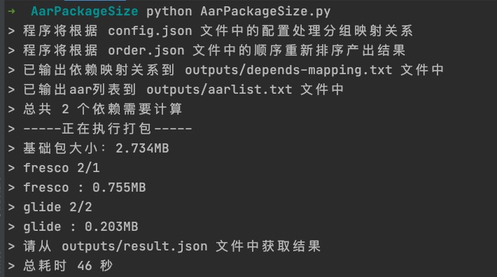

# 快速批量统计aar包大小

本项目可简单快速产出AAR在APK中的大小。

## Demo效果
克隆本工程在终端使用python执行如下脚本：

```
python AarPackageSize.py
```



## 使用
使用以下命令获取依赖树，在app模块目录下执行如下命令会得到一个名为depends.txt结果文件：
```
../gradlew -q dependencies --configuration releaseRuntimeClasspath > depends.txt
```

将depends.txt文件复制到本工程下覆盖原文件，在工程根目录下执行python命令，可以在终端看到执行的过程及结果：
```
python AarPackageSize.py
```

## 注意事项
1. 根据实际情况修改app的so架构，默认为armeabi-v7a  
2. 将aar所在的仓库地址配置在本工程中
3. 在config.json文件中配置依赖分组
4. 在order.json文件中配置结果输出顺序

##  License
```
Copyright 2021 yuweiguocn

Licensed under the Apache License, Version 2.0 (the "License");
you may not use this file except in compliance with the License.
You may obtain a copy of the License at

   http://www.apache.org/licenses/LICENSE-2.0

Unless required by applicable law or agreed to in writing, software
distributed under the License is distributed on an "AS IS" BASIS,
WITHOUT WARRANTIES OR CONDITIONS OF ANY KIND, either express or implied.
See the License for the specific language governing permissions and
limitations under the License.
```